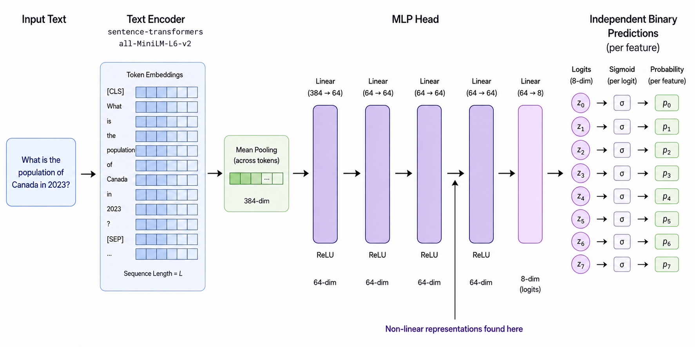

# BlueDot Technical AI Safety Puzzle #1

We trained a small classifier on short text inputs to predict eight binary features simultaneously, at over 95% accuracy on each:

- `number` — contains a digit or written-out number (`3`, `seven`, …)
- `question` — phrased as a question (ends in `?`, or starts with `who/what/why/…`)
- `color` — contains a color word (`red`, `blue`, …)
- `food` — mentions food (`pizza`, `apple`, `soup`, …)
- `sentiment` — has positive vs. negative sentiment
- `country` — contains a country name (`Japan`, `France`, `USA`, …)
- `person` — contains a person's name (`Alice`, `Mark`, …)
- `body_part` — contains a body-part word (`hand`, `eye`, …)

After a particular layer L of this model, seven of these features are represented linearly, where a single direction in the activation space describes that feature. However, one feature F is represented in a different way. Your job is to figure out which feature it is and how it is represented.

## Your three tasks

**1. Find F.** Identify which of the eight features is not represented linearly.

**2. Explain how F is represented.** Describe the geometric structure the model uses to represent F at layer L. Show the analysis you used to convince yourself. 

**3. [Open ended] Train a model with an even weirder representation of F.** Train your own model that encodes F (or some other feature) in a more interesting way than ours. "More interesting" is up to you to define and defend. 

## What you'll submit

A single google doc, documenting what you tried, what worked, what didn't, and what structure emerged in the trained model. We'll happily read about your failures if the path to them was thoughtful. 

## What you get

Prizes for best submissions:

- 1st place: $1,000.
- 2nd place: $750.
- 3rd place: $500.
- Honourable mentions: $250 each.

All submissions that answer parts 1 and 2 correctly will be considered for our Technical AI Safety course (featuring rapid grant and career transition grant opportunities).


## The model architecture

The model consists of the 
`sentence-transformers/all-MiniLM-L6-v2` text encoder followed by a mean pool to get a single 384-dimensional representation of that input. This is then fed through a 5 layer MLP with ReLUs between the layers. The resulting 8 logits are then fed through individual sigmoid functions to recover the predicted probabilities for the 8 features. 



The 8 probabilities don't need to sum to 1 because the eight features aren't mutually exclusive. The model was trained with per-feature binary cross-entropy across the eight outputs.


## What's in this repo

- `model.pt` — trained classifier state dict (~150 KB).
- `data/train.jsonl` — 7000 lines of
  `{"text": "...", "labels": [1, 1, 0, 0, 1, 0, 0, 1]}`. Labels indexed by
  `feature_names.json`.
- `data/test.jsonl` — 1500 lines, same format. Use this as a held-out test set.
- `feature_names.json` — the eight feature names, indexed 0–7.


## Setup

```bash
pip install sentence-transformers torch
```

## Code to get you started

```python
import torch, torch.nn as nn
from sentence_transformers import SentenceTransformer

# --- 1. Define the MLP head  ---
class Head(nn.Module):
    def __init__(self):
        super().__init__()
        self.layers = nn.Sequential(
            nn.Linear(384, 64), nn.ReLU(),   # hidden 0
            nn.Linear(64, 64),  nn.ReLU(),   # hidden 1
            nn.Linear(64, 64),  nn.ReLU(),   # hidden 2  ← non-linear activation here (post-ReLU)
            nn.Linear(64, 64),  nn.ReLU(),   # hidden 3
            nn.Linear(64, 8),                # logits
        )
    def forward(self, x):
        return self.layers(x)

# --- 2. Load encoder (downloaded from HF) and head (local file) ---
enc = SentenceTransformer("sentence-transformers/all-MiniLM-L6-v2")
m = Head()
m.load_state_dict(torch.load("model.pt", map_location="cpu", weights_only=False))
m.eval()

# --- 3. Get predictions ---
texts = ["example input one", "example input two"]

with torch.no_grad():
    embeddings = torch.from_numpy(
        enc.encode(texts, convert_to_numpy=True)   # (N, 384), mean-pooled
    )
    logits = m(embeddings)                          # (N, 8)
    probs  = torch.sigmoid(logits)                  # (N, 8) — independent per feature
    preds  = (probs > 0.5).int()                    # (N, 8) — binary predictions

# --- 4. Get activations at the right spot (post-ReLU of hidden 2) ---
# layers[0:6] = Linear, ReLU, Linear, ReLU, Linear, ReLU  → output is hidden 2 post-ReLU
with torch.no_grad():
    layer2_acts = m.layers[:6](embeddings)          # (N, 64)
```
