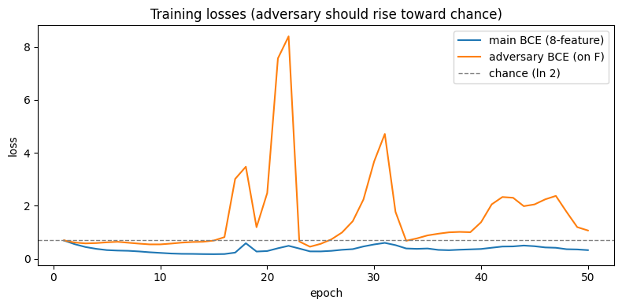
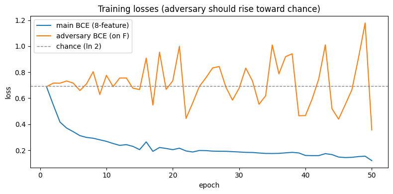
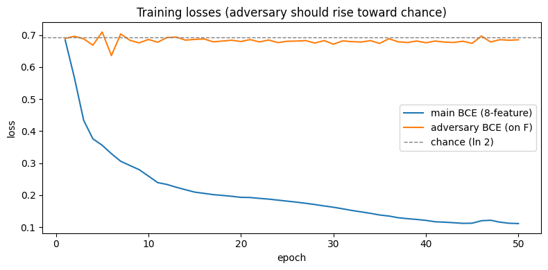

# Q3 — Adversarial probe-resistance experiment

## Goal

Pick a feature F from the original 8 (we chose **`sentiment`**, the cleanest linearly-encoded one) and retrain the MLP head with an **adversarial probe** attached to hidden 2. Desired outcome:

- Linear probe on hidden 2 for F → drops to chance (~0.50)
- Model's own head on F → stays high (≥ 0.95)
- Other 7 features → unaffected

Implementation: gradient-reversed (GRL) adversarial training, then switched to a separate-optimizer + inner-steps + reinit recipe. Notebook: `q3_adversarial_probe.py`.

## Setup

- Same architecture as the original puzzle (5-layer MLP head, frozen MiniLM embeddings).
- Adversary attached at post-ReLU hidden 2.
- Adversary forms tried: linear (`Linear(64,1)`).
- F = `sentiment`.
- Baseline accuracies from the provided `model.pt`: linear probe on sentiment = 0.98, model's own head = 0.98.

## Iterations

### Run 1: naive GRL, λ_max = 1.0

Single optimizer over body + adversary, GRL flipping gradients. Linear ramp 0 → 1.

| probe at hidden 2 | original | adv-trained |
|---|---:|---:|
| Linear LogReg on F | 0.982 | 0.935 |
| Degree-2 poly LogReg on F | 0.982 | 0.949 |
| Model's own head on F | 0.982 | 0.802 |
| Avg linear probe on other 7 | 0.905 | 0.943 |

**Result:** λ too weak. Linear probe barely budged; head started degrading. Worst of both.

Loss curves (showed mild waviness, no real adversary pressure):

### Run 2: GRL, λ_max = 3.0

Same setup, stronger λ.

| probe | original | adv-trained |
|---|---:|---:|
| Linear LogReg on F | 0.982 | 0.913 |
| Degree-2 poly LogReg on F | 0.982 | 0.919 |
| Model's own head on F | 0.982 | **0.554** |
| Avg linear probe on other 7 | 0.905 | 0.883 |

**Result:** Worse. Head collapsed to chance, linear probe still readable. The training oscillated wildly — the body fooled stale adversary weights rather than scrubbing the linear direction.

### Run 3: separate optimizers, adversary LR=5e-3, K=3 inner steps, λ_max = 1.5

Standard GAN-stability remedy: separate optimizer for adversary at 5× the body's LR, K=3 adversary updates per body update.

| probe | original | adv-trained |
|---|---:|---:|
| Linear LogReg on F | 0.982 | 0.929 |
| Degree-2 poly LogReg on F | 0.982 | 0.932 |
| Model's own head on F | 0.982 | 0.852 |
| Avg linear probe on other 7 | 0.905 | 0.975 |

**Result:** Training stabilized — the oscillation is gone. But linear probe still recovers F at 0.93. In-loop adversary loss noisy around chance; a post-hoc L-BFGS probe finds the linear direction the in-loop SGD adversary couldn't track. **Moving-target gap.**

### Run 4: K=10 inner steps + adversary reinit every 5 epochs, λ_max = 2.0

To close the moving-target gap: more inner steps and periodic reinit of the adversary (force the body to defend against many random initializations of the linear classifier, not just one trajectory).

| probe | original | adv-trained |
|---|---:|---:|
| Linear LogReg on F | 0.982 | **0.773** |
| Degree-2 poly LogReg on F | 0.982 | 0.806 |
| Model's own head on F | 0.982 | 0.537 |
| Avg linear probe on other 7 | 0.905 | 0.984 |

**Result:** Best clean equilibrium so far — adversary BCE pinned at chance for ~45 epochs, main BCE drops smoothly. Linear probe drops 20pp. Other 7 features fully preserved.

But **still a failure on both goals**:
- Linear probe at 0.77 is *not* chance — sentiment remains partially linearly readable.
- Model's own head at 0.54 is chance — the model lost the ability to predict F itself.

We pushed sentiment off the linear direction by **erasing the information**, not by **re-encoding it non-linearly**, so the head can't recover it either.

## Conclusion: structural limit, not a tuning miss

The original puzzle's `country` quadric works because:

- Country is *naturally* multi-cluster in MiniLM embeddings (different countries → different sub-clusters).
- A quadric envelope around those clusters is a representation the model can find.
- The downstream Linear→ReLU→Linear has enough capacity to decode that quadric.

Sentiment is *naturally* linear in MiniLM embeddings — there is no inherent non-linear shape it can take. So when adversarial pressure forces "not linear," the body's only option is to make the information weak, not just non-linear. Weak information means the head can't use it either. The Linear→ReLU→Linear downstream isn't deep enough to invent a non-linear sentiment code on its own.

In short: **adversarial linear-probe resistance on naturally-linear features doesn't reach the (low probe, high head) regime in this architecture.** Either:

- the feature has natural non-linear structure (like country) and probably doesn't need adversarial training, or
- the downstream capacity needs to be larger, or
- a different mechanism (sparse autoencoder bottleneck, topological auxiliary loss) is more appropriate.

## What we'd try next (not pursued)

- **F = country.** Already encoded non-linearly. Push from quadric → degree-3+ via deg-2 adversary. The downstream capacity already proved sufficient.
- **Idea #2 (topological).** Force F onto a circle via an auxiliary regression to (sin θ, cos θ). Mirrors Engels et al. days-of-week. Likely more stable than adversarial.
- **Idea #3 (superposition).** Shrink hidden 2 + L1 sparsity. Different flavor of "weird"; addresses a different research question. Most stable to train.
